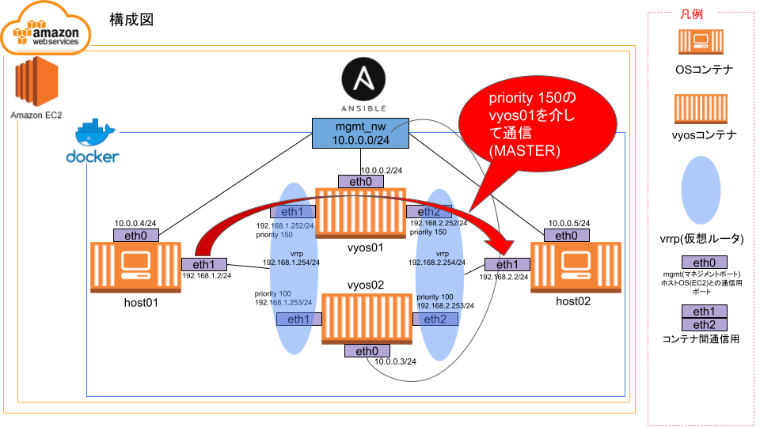
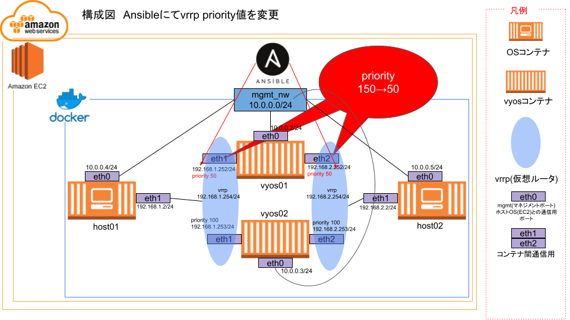
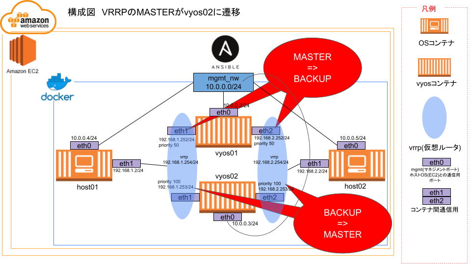
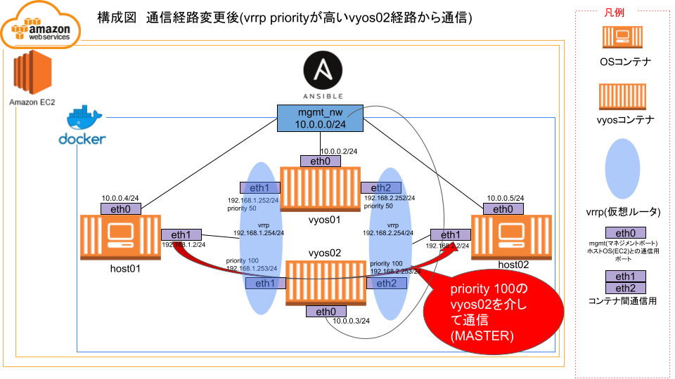

# 2023年度新卒向け Ansible自動化研修
## 2023/6/5

---

<!--
class: slide
paginate: true
-->

# 講師の自己紹介

- 名前：佐々木 志穂（ささき しほ）
- 所属：BzD部 ACT
　　　 NW自動化横串T
- 年齢：24 
　　　 中途未経験で入社してもうすぐ4年です
- 趣味：ライブにいくこと、旅行、ゲーム実況をみること、
　　　        お酒のむこと…etc （多趣味です）
- 今日の意気込み：新卒研修は今年初めて担当させていただきます。
　　　　　　　　        よろしくお願いいたします！

---

# 新卒のみなさまの自己紹介
名前・所属・趣味などを、1人1分程度でお願いします！

---

# 自動化のメリットデメリット

## メリット
- 1つ1つ手動で設定 → 1回の実行で自動で設定することができる
- 間違い・作業ミスが減る
- 作業が構造化される

## デメリット
- コードを書く人が必要
- 対応している機器・対応していない機器がある
→ 自動化した方が複雑になってしまうケースがある
- エラー時の原因特定が難しい

---

# Ansibleとは？
こちらの資料のp3~p8 
https://docs.google.com/presentation/d/1kfFVg4U-lcrZIbvSvCkSnkxo6QccC8pG/edit#slide=id.p1

---

# Ansibleを体験するための環境構築

### 1. AWSにログイン
   - Gmail → Googleアプリ → AWS for APC を選択

### 2. AWSでEC2インスタンスを立てる
  - Meetの画面を見ながら、EC2インスタンスを起動していきましょう。

### 3. TeraTermでEC2インスタンスにログイン
  - TeraTermを起動
  - EC2インスタンスのパブリックIPアドレスにSSHログイン
  - ユーザ名：ec2-user パスフレーズ：空欄
  EC2インスタンスを立てたときにダウンロードした、秘密鍵のpathを指定します

---

### 4. ここからはTeraTermで実行してください。 amazon-linuxで必要なものを有効化し、ansibleとgitをインストール。 初期設定用ファイルをgit clone

    sudo amazon-linux-extras enable ansible2 epel docker

    sudo yum clean metadata && sudo yum install -y ansible git
    
    git clone https://github.com/nw-auto-cft/ansible_on_vyos

### 5. Dockerのinstallなどをansibleで実行

    cd ansible_on_vyos
    
    ansible-playbook /home/ec2-user/ansible_on_vyos/init_settings/init_install.yml

---

### 6. ここで再度ec2-userでssh login
altキー + D で再ログイン(新しいウィンドウが立ち上がります)

### 7. venv読み込み
    source /home/ec2-user/venv/bin/activate
promptに(venv)が付いたことを確認

### 8. docker内にコンテナを作る
    docker-compose -f /home/ec2-user/ansible_on_vyos/init_settings/docker-compose.yml up -d

---

### 9.vyosが無事立ち上がってることを確認
    sudo docker exec -it vyos01 su - vyos
=>promptがvyos@vyos:~$ であることを確認

    exit

### 10.コンテナの初期設定用のplaybookを実行

    cd /home/ec2-user/ansible_on_vyos/init_settings/

    ansible-playbook -i inventory.ini container_setting.yml

---
# Ansible playbookを実行する
### playbook実行前の状態

---
### playbookを実行して、VRRPのプライオリティ値を150→50に変更する。

---
### VRRPのMASTERとBACKUPが入れ代わる

---

### vyos01のVRRPのプライオリティ値を150→50に変更したことで、  vyos02のVRRPプライオリティ値の方が高くなる

---

# Ansible playbookの説明
こちらの資料のp11~16 
https://docs.google.com/presentation/d/1kfFVg4U-lcrZIbvSvCkSnkxo6QccC8pG/edit#slide=id.p1

---

### 1. playbook実行前状態確認（tracerouteで経路確認）

    docker exec -it host01 /bin/bash

    traceroute 192.168.2.2
vyos01.service_nw01 (192.168.1.252)経由であることを確認

    exit
 

    docker exec -it host02 /bin/bash

    traceroute 192.168.1.2
vyos01.service_nw02 (192.168.2.252)経由であることを確認

    exit

---

### 2. vrrp値を変更するplaybookを実行

    cd /home/ec2-user/ansible_on_vyos/ansible_practice/link_bypass

    ansible-playbook -i inventory.ini link_bypass_simple.yml

---

### 3. playbook実行後状態確認（tracerouteで経路確認）

    docker exec -it host01 /bin/bash

    traceroute 192.168.2.2
vyos02.service_nw01 (192.168.1.253)経由であることを確認

    exit
 

    docker exec -it host02 /bin/bash

    traceroute 192.168.1.2
vyos02.service_nw01 (192.168.2.253)経由であることを確認

    exit

---

# Ansible playbookを作成して実行する

### 迂回戻しのplaybookを作成してみよう
- 先ほどのplaybookを実行したことで、vyos02を通るようになった
- vyos01を通るようにするplaybookを作成してみよう

### ヒント
- 先ほど実行したplaybookを、別名義でコピーする
- コピーしたplaybookに書いているVRRPのプライオリティ値を変更してみる

---

# この自動化をもっと良くするには？
1人1ずつ(1つ以上でも！)案を出してみましょう

---

